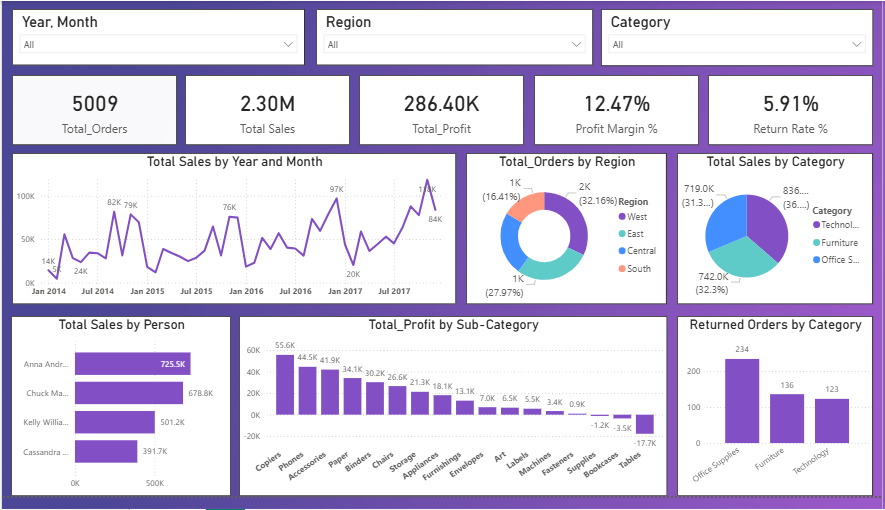

# Business Overview Performance (Power BI)

## Project Overview
This Power BI dashboard provides a detailed analysis of sales, profits, and return rates across different regions and categories.

## Key Insights
* **Financial Overview:** Total Sales reached $2.30M with a Total Profit of $286.40K and a 12.47% Profit Margin.
* **Regional Performance:** The West region leads in order volume, accounting for 32.16% of total orders.
* **Category Analysis:** Technology is the top-selling category ($836.2K), while Office Supplies had the highest return volume (234 returns).
* **Top Profit Maker:** Copiers are the most profitable sub-category, contributing $55.6K in profit.
* **Top Salesperson:** Anna Andreadi is the top performer with total sales of $725.5K.

## Dashboard Preview

## Tools Used
* Power BI (DAX: CALCULATE, FILTER).
* Power Query for data cleaning.
